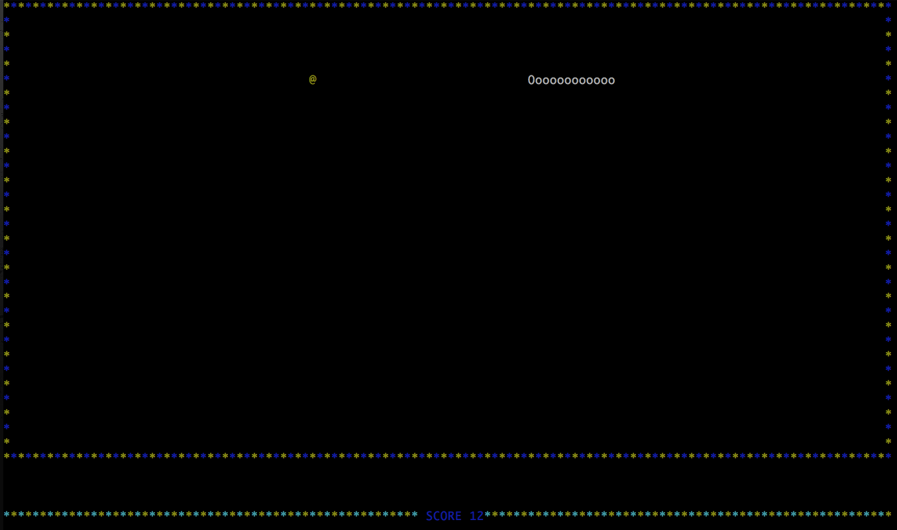

# Snake

The aim of this game is collecting the gold (@). 
As you collect gold, the snake gets longer, thus increasing the likelihood of crashing into yourself. 

## The rules of the game:

    The player loses when the snake runs into the screen border or itself.
## Hot Keys:

    UP, DOWN: move along the Y-axis
    LEFT, RIGHT: move along the X-axis

Dependencies
============

    This game needs ncurses and a C compiler.

## Building on macOS
1. Ncurses can be installed via Homebrew :
   <code>$ brew install ncurses</code>
    
2. Clone the repository
3. Run <code>make</code>
4. Run the executable <code>snake</code>

